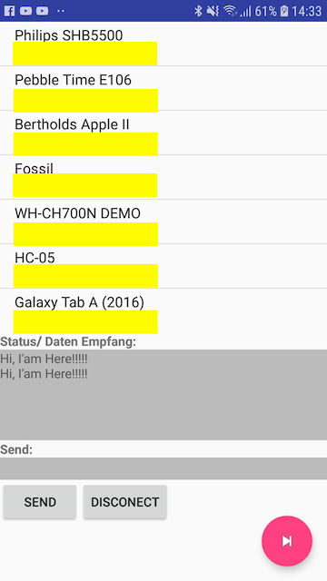
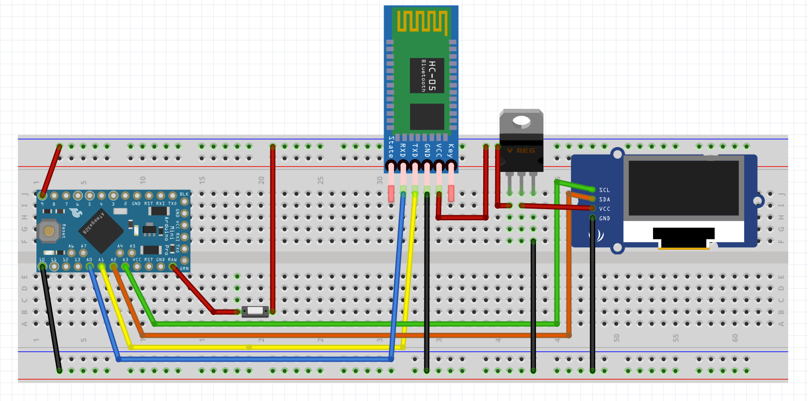

Bluetooth sender and receiver
=============================
Shows how to exchange data between an Android app and a Tensy 2.0/ HC05- bluetooth module.
Data received is displayed on an connected OLED- display. Data can be send to the Android app by
pressing a push- button. 

The Android app serves as very simple data terminal.The app is generic and can be used for
wide range of applications for serial communication via Bluetooth.

More Information about the project can be found here:[CodingByChanche Blog](https://codingbychance.wordpress.com/2020/01/19/tensy-2-0-bluetooth-sender-receiver/?preview_id=973&preview_nonce=b2c4503f9e&preview=true) (German language Blog)

Screenshoot
===========

Circuit
=======

